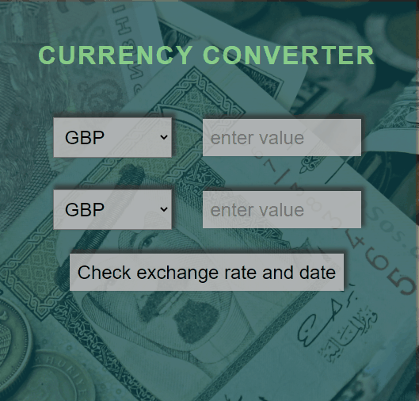

# Simply Currency Converter
This is a simple currency converter that converts the value of a chosen currency to value of another currency. Converter use free Exchange rates API to give You as current rate as it possible.

# Live Demo
https://mateusz24polok.github.io/currency-converter/

# Instructions how to use
1. Select your currency from list in first line
2. Enter value of currency You want to exchange
3. In second line select currency in which you want to get money
4. By clicking "Check exchange rate and date" button You can check exactly details of exchange conversion

# Technologies
## Technologies used in project:
- Semantic HTML
- CSS with Flexbox
- JavaScript (ES6+)
- GoogleFonts
- AJAX
- Fetch API

## Extra features:
- Extern foreign exchange rates API with currency conversion (https://exchangeratesapi.io/)
- Protection against entering a negative currency value

# Author and contact
- author: Mateusz Polok
- email: mateusz24polok@gmail.com
- phone: +48535731868